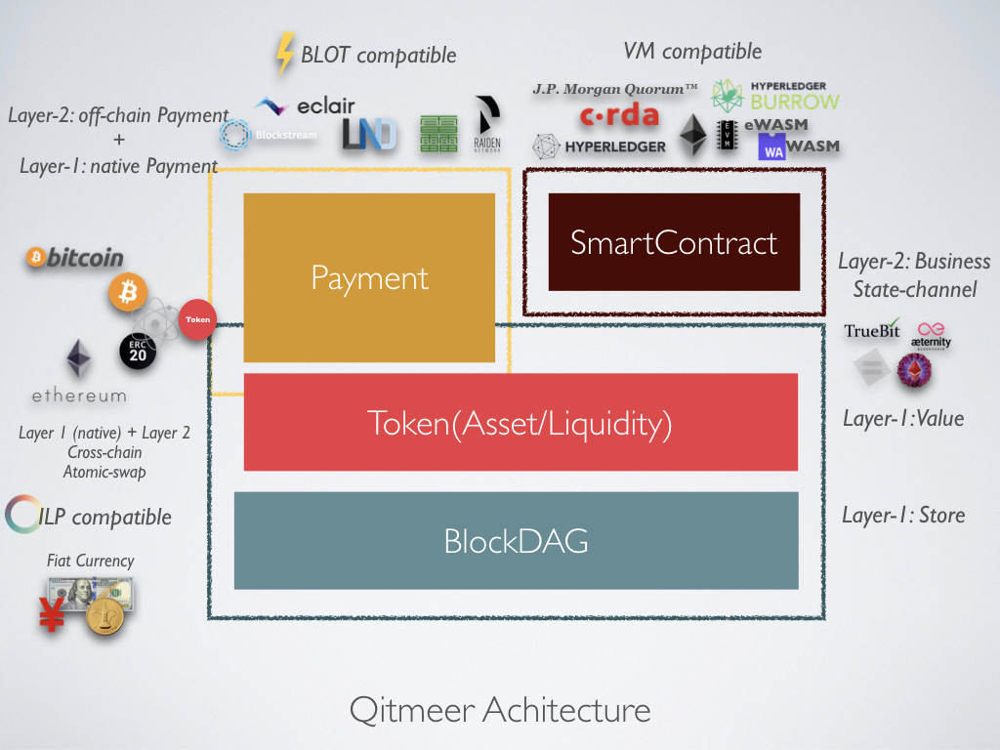

# Qitmeer Tech Architecture :: Qitmeer Documentation

### Qitmeer Tech Architecture 

#### Architecture Chart 

#### Architecture Expained 

1. Qitmeer empowers BlockDAG as its underlying ledger data structure, working with Proof-of-Work based consensus protocol, such as SPECTRE, to provide an open, fair, secure and scalable payment network.
2. Qitmeer assets issurance componet, OP\_TOKEN, is based on UTXO transaction model, to support massive token liquidity. OP\_TOKEN is backed by native currency and requires authority-owned licenses to publish, which is able to avoid scammer tokens.
3. Qitmeer offers off-chain payment and smart contract protocols to combine various crypto ecomoic scenarios into a unified ecosystem. VM compatiple smart contract platforms, state-channel platforms, crypto assets can converge into Qitmeer through cross-chain interoperbility.
